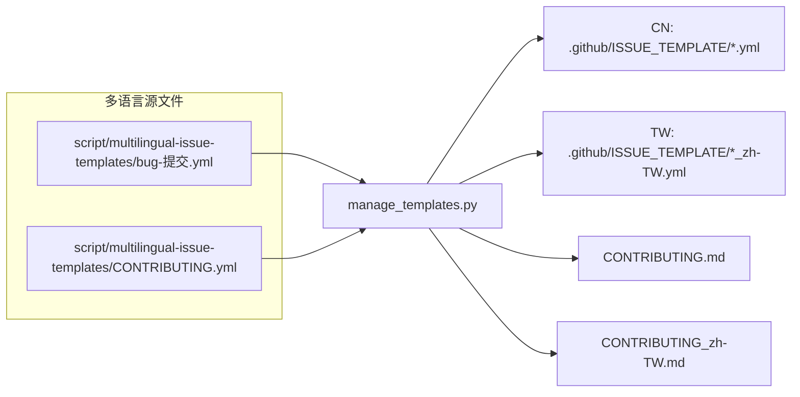

<!-- 由 manage_templates.py 自动生成，请勿手动编辑。来源：CONTRIBUTING.yml -->

<div align="center"><a name="contributing-top"></a>

# 贡献指南

**简体中文** · [繁體中文](./CONTRIBUTING_zh-TW.md)

</div>

## 设置开发环境

1. [克隆仓库](https://docs.github.com/repositories/creating-and-managing-repositories/cloning-a-repository)
1. 进入仓库目录：
  [Bash](https://www.gnu.org/software/bash/manual/bash.html#index-cd 'cd') ·
  [Zsh](https://zsh.sourceforge.io/Doc/Release/Shell-Builtin-Commands.html 'cd') ·
  [Fish](https://fishshell.com/docs/current/cmds/cd.html 'cd') ·
  [C Shell](https://www.freebsd.org/cgi/man.cgi?query=cd&sektion=1 'cd') ·
  [Windows 命令提示符](https://learn.microsoft.com/windows-server/administration/windows-commands/cd 'cd') ·
  [PowerShell](https://learn.microsoft.com/powershell/module/microsoft.powershell.management/set-location 'Set-Location') ·
  [Windows 文件资源管理器](https://windowsforum.com/windows-news.4/bridge-file-explorer-and-terminal-in-windows-11-for-faster-workflows.389155/#_xfUid-1-1781860855 '在终端中打开')
1. [创建和激活虚拟环境](https://docs.python.org/3/library/venv.html)
1. 安装依赖：
    ```bash
    python script/manage_templates.py --requirements
    pip install -r script/requirements.txt
    ```
1. 启用提交前的钩子（提交前自动验证多语言源文件）：
    ```bash
    git config core.hooksPath .githooks
    ```

## 贡献方式

欢迎通过以下方式参与贡献：

1. 完善词库翻译（编辑 [`locals.js`](locals.js)）
1. 提交议题报告，参与话题讨论
1. 改进代码逻辑


[](https://github.com/maboloshi/github-chinese/pulls)


### 翻译参考资源

1. [Pro Git 第二版 简体中文](https://git-scm.com/book/zh-tw/v2)
1. [Pro Git: 翻译约定](https://github.com/progit/progit2-zh/blob/master/TRANSLATION_NOTES.asc)
1. [Git 官方软件包的简体中文翻译](https://github.com/git/git/blob/master/po/zh_CN.po)
1. [GitHub 术语表](https://docs.github.com/get-started/learning-about-github/github-glossary)
1. **[CSS 选择器](https://developer.mozilla.org/docs/Web/CSS/Reference/Selectors)用于编写忽略规则**

## 议题模板工作流

### 自动生成

议题模板和本贡献指南的维护采用**多语言源文件驱动**模式：



### 维护

1. 编辑 [`script/multilingual-issue-templates/bug-提交.yml`](script/multilingual-issue-templates/bug-提交.yml)
1. 验证和预览（可选）
   1. 验证多语言源文件（提交会自动触发）：
      ```bash
      python script/manage_templates.py --check
      ```
      或 Windows 用包装脚本 `script/manage.ps1`（自动选 venv Python 且 UTF-8 输出不乱码）：
      ```powershell
      .\script\manage.ps1 --check
      ```
      命令提示符则通过 PowerShell 调用：
      ```cmd
      powershell -ExecutionPolicy RemoteSigned -File script\manage.ps1 --check
      ```
   1. 预览生成的 CN/TW 模板：如果使用 VS Code，可启用 [GitHub Issue Template Preview](https://marketplace.visualstudio.com/items?itemName=ReesPozzi.github-issue-template-preview)。如果 [reespozzi/gh-issue-template-preview#14](https://github.com/reespozzi/gh-issue-template-preview/pull/14) 尚未合并，请[调试](https://code.visualstudio.com/api/get-started/your-first-extension#debugging-the-extension)待合并的分支。
1. [提交](https://docs.github.com/pull-requests/how-tos/commit-changes) → 提交前的钩子自动验证
1. [推送](https://docs.github.com/get-started/using-git/pushing-commits-to-a-remote-repository '推送提交到远程仓库') → [拉取请求](https://docs.github.com/pull-requests/how-tos/create-pull-requests/creating-a-pull-request '创建拉取请求') → [持续集成](https://docs.github.com/actions/get-started/continuous-integration '持续集成')验证 → 合并到默认分支 → 云端自动生成并提交模板
