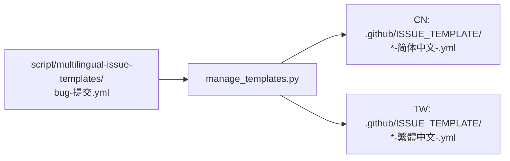

# 贡献指南

## 设置开发环境

1. [克隆仓库](https://docs.github.com/repositories/creating-and-managing-repositories/cloning-a-repository)
2. 进入仓库目录：[Bash](https://www.gnu.org/software/bash/manual/bash.html#index-cd 'cd') ·  [PowerShell](https://learn.microsoft.com/powershell/module/microsoft.powershell.management/set-location 'Set-Location') · [Windows 文件资源管理器](https://windowsforum.com/windows-news.4/bridge-file-explorer-and-terminal-in-windows-11-for-faster-workflows.389155/#_xfUid-1-1781860855 '在终端中打开')
3. [创建虚拟环境](https://docs.python.org/3/library/venv.html#how-venvs-work)

```bash
.venv\Scripts\pip install pyyaml opencc-python-reimplemented
```

3. 启用 pre-commit hook（提交前自动验证多语言源文件）：

```bash
git config core.hooksPath .githooks
```

## 议题模板工作流

### 自动生成

议题模板的维护采用**多语言源文件驱动**模式：



### 维护

1. 编辑 [`script/multilingual-issue-templates/bug-提交.yml`](script/multilingual-issue-templates/bug-提交.yml)
1. 验证多语言源文件（可选，commit 会自动触发）：
   ```bash
   python script/manage_templates.py --check
   ```
1. `git commit` → pre-commit hook 自动验证
1. `git push` → PR → CI 验证 → 合并到 `main` → 云端自动生成并提交模板
